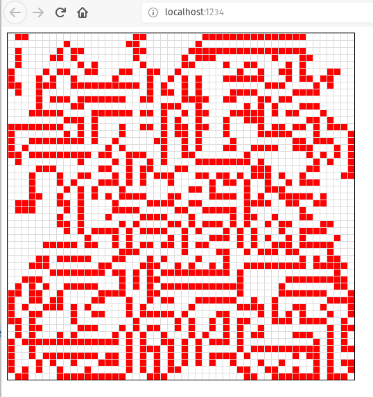
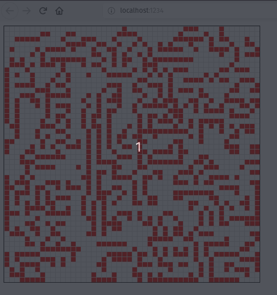
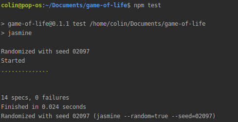
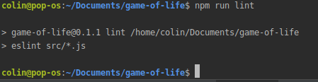

## Game of Life

#### Written in Javascript with HTML5 canvas

As a fun project post-Makers, I wanted to brush up my JavaScript and explore something new and widely applicable, so I looked to HTML5 canvas for inspiration. I chose Game of Life as it's fun, combines visuals with logic and can be deceptively complex.
This is based on [Conway's Game of Life](https://en.wikipedia.org/wiki/Conway%27s_Game_of_Life).

#### Learning objectives

- Improve JavaScript knowledge
- Understand how to run ES6+ code in browsers
- Explore the basics of HTML5 Canvas
- Do something fun 

#### Approach

As I wanted to use JavaScript classes and other ES6+ functionality, that meant using a transpiler to convert the javascript into browser-acceptable code. I looked at `Babel` but then decided to go with `Parcel` as it was fast, handled `Babel` for me and also allowed bundling of assets out of the box, should it become needed. 

I wanted to TDD the business logic, so used `jasmine` for unit and feature tests and `eslint` for to help reinforce my understanding of style conventions.

I decided against testing the HTML5 Canvas output directly as I was also working on other priorities, so tests are generally directed at the functionality of the `Board` and `Cell` classes rather than the `Game` class.

I chose to keep the `Cell` class ignorant of location on the Board (i.e. a cell doesn't know its own coordinates), but the board knows the coordinates of each cell. This felt most in keeping with OOP principles, but might cause issues with optimisation later if I need to work directly with cells for performance reasons (e.g. as knowledge of board location is needed to work out neighbours).

#### Performance

Performance was improved from the earliest versions by minimising unnecessary assignments and especially eliminating looping where possible. There is now only a single iteration over the board for each frame of the game and other functionality is directed at specific cells or board coordinates to improve speed as much as possible.

As there is a 2d coordinate array this currently involves a double for loop, which makes my efficiency eyebrow twitch, so refactoring this is on the cards as I'd like to think up a better way of doing it. 

Potential areas for improvement include updating cells only if there's a change of status (maybe by maintaining an index of cell states somehow?) or possibly trying to eliminate the loop entirely and applying actions to groups of cells without iterating over the whole board. 

#### Instructions

- Install `JavaScript` and `NodeJS` per the instructions for your operating system
- Clone the project 
- Run `npm install` in the project root to pull in all the needed dependencies
- Execute `npm run dev` to launch `parcel` and navigate to `localhost:1234` when built to view the game running

To test: `npm test`
To lint: `npm run lint` 

#### Screenshots

Screenshot:

In motion:

Passing tests:

Passing linter:

 